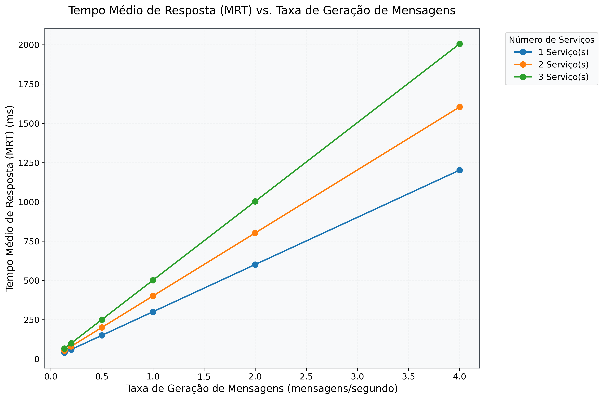

# PASID Validator

Um sistema de validação e balanceamento de carga que utiliza modelos de IA para processamento de requisições.

## 📋 Descrição

O PASID Validator é um sistema que implementa um balanceador de carga com múltiplos serviços backend, cada um utilizando um modelo de IA para processamento de requisições. O sistema permite validar o desempenho e comportamento dos serviços em diferentes configurações.

## 🚀 Como Executar

### Pré-requisitos

- Python 3.8+
- Docker e Docker Compose (opcional)

### Instalação

1. Clone o repositório:

```bash
git clone (https://github.com/Gabriel-Leall/Sistema_Distribuidos.git)
cd pasid-validator
```

2. Instale as dependências:

```bash
pip install -r requirements.txt
```

### Executando com Docker

Para executar todo o ambiente usando Docker Compose:

```bash
docker-compose up
```

### Executando Manualmente

O sistema possui três componentes principais que podem ser executados separadamente:

1. **Source** (Gerador de Requisições):

```bash
python main.py source
```

2. **Load Balancer**:

```bash
python main.py loadbalance [PORTA] [ENDERECOS_SERVICOS]
# Exemplo: python main.py loadbalance 2000 "localhost:3000,localhost:3001"
```

3. **Service** (Serviço Backend):

```bash
python main.py service [PORTA] [TEMPO_SERVICO_MS] [MODELO_IA]
# Exemplo: python main.py service 3000 100 "modelo1"
```

## 📊 Resultados

O sistema gera gráficos de análise de desempenho que são salvos no diretório `graphs/`. Abaixo está o gráfico que mostra a relação entre o MRT (Mean Response Time) e a taxa de geração de mensagens:

<div align="center">
  
  <p><i>Gráfico: MRT vs Taxa de Geração de Mensagens</i></p>
</div>

### Como Gerar os Gráficos

Os gráficos de desempenho são gerados a partir de um arquivo de log (`log.txt`) que registra o comportamento do sistema. Para gerar este arquivo de log e, em seguida, os gráficos, siga os passos:

1.  **Gerar o Arquivo de Log (`log.txt`):**

    - Para que o `gerar_graficos.py` funcione, você primeiro precisa executar o sistema para que ele gere o `log.txt`. O sistema completo envolve a execução do `Source`, `Load Balancer` e `Service`.
    - Siga as instruções em "Executando Manualmente" (ou "Executando com Docker") para rodar o sistema e permitir que ele gere dados no `log.txt` na raiz do projeto.

2.  **Pré-requisitos para Geração dos Gráficos:**

    - Certifique-se de ter o Python 3.8+ instalado.
    - Instale a biblioteca `matplotlib` caso ainda não a tenha: `pip install matplotlib`.

3.  **Executar o Script de Geração de Gráficos:**
    - Abra o terminal ou prompt de comando.
    - Navegue até o diretório `src` do projeto:
      ```bash
      cd pasid-validator/src
      ```
    - Execute o script Python:
      ```bash
      python gerar_graficos.py
      ```

Os gráficos gerados serão salvos na pasta `graphs` dentro do diretório `src` (`pasid-validator/src/graphs/`).

## 🏗️ Estrutura do Projeto

```
pasid-validator/
├── src/                    # Código fonte
├── resultados/            # Gráficos e resultados
├── logs/                 # Logs do sistema
├── main.py              # Ponto de entrada principal
├── requirements.txt    # Dependências Python
├── Dockerfile         # Configuração Docker
└── docker-compose.yml # Configuração do ambiente
```

## ⚙️ Configuração

O sistema pode ser configurado através do dicionário de configuração no arquivo `main.py`. As principais configurações incluem:

- `model_feeding_stage_enabled`: Habilita etapa de alimentação do modelo
- `validation_stage_enabled`: Habilita etapa de validação
- `source_port`: Porta do gerador de requisições
- `target_port`: Porta do balanceador de carga
- `max_considered_messages_expected`: Número máximo de mensagens
- `arrival_delay`: Delay entre requisições
- `qtd_servicos`: Quantidade de serviços a serem testados

```

```
